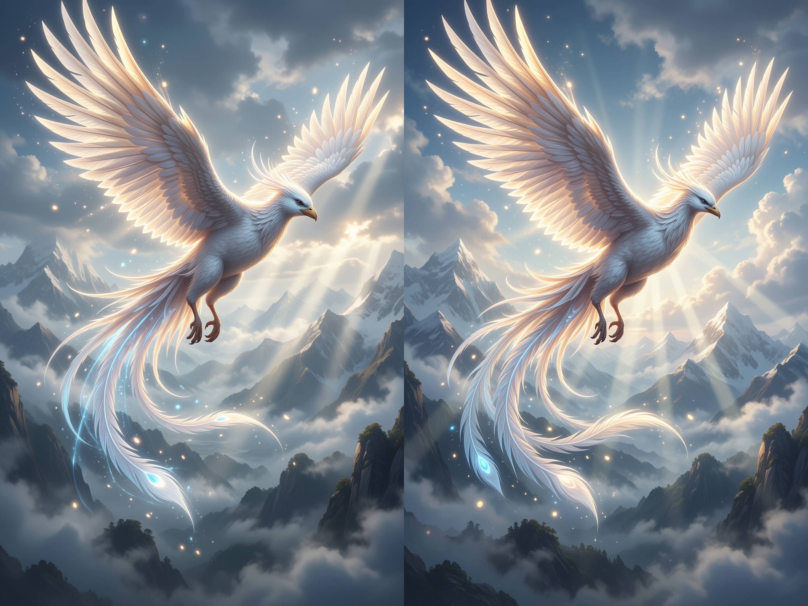
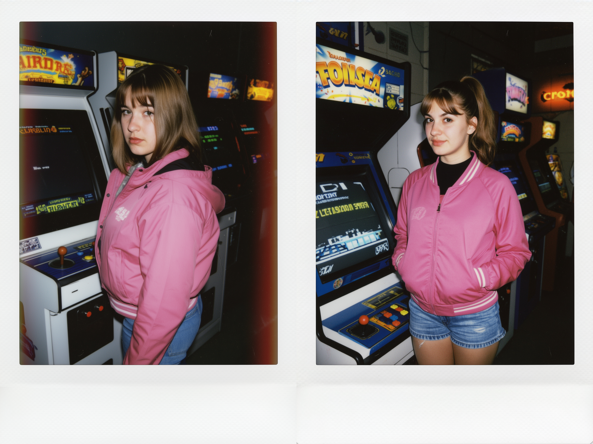
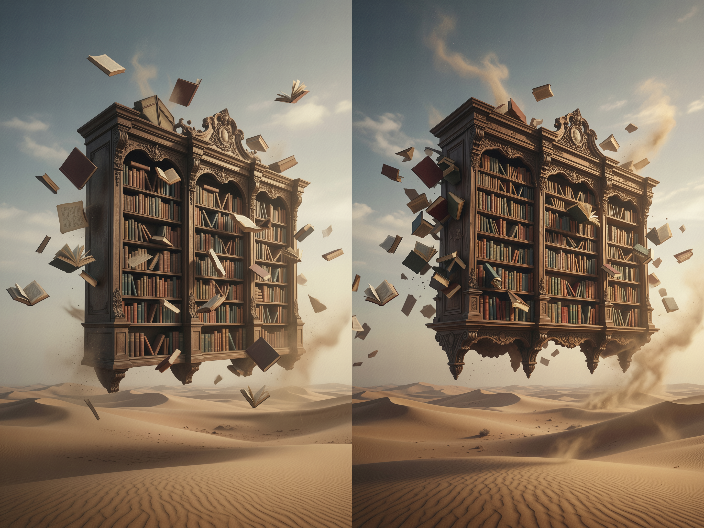
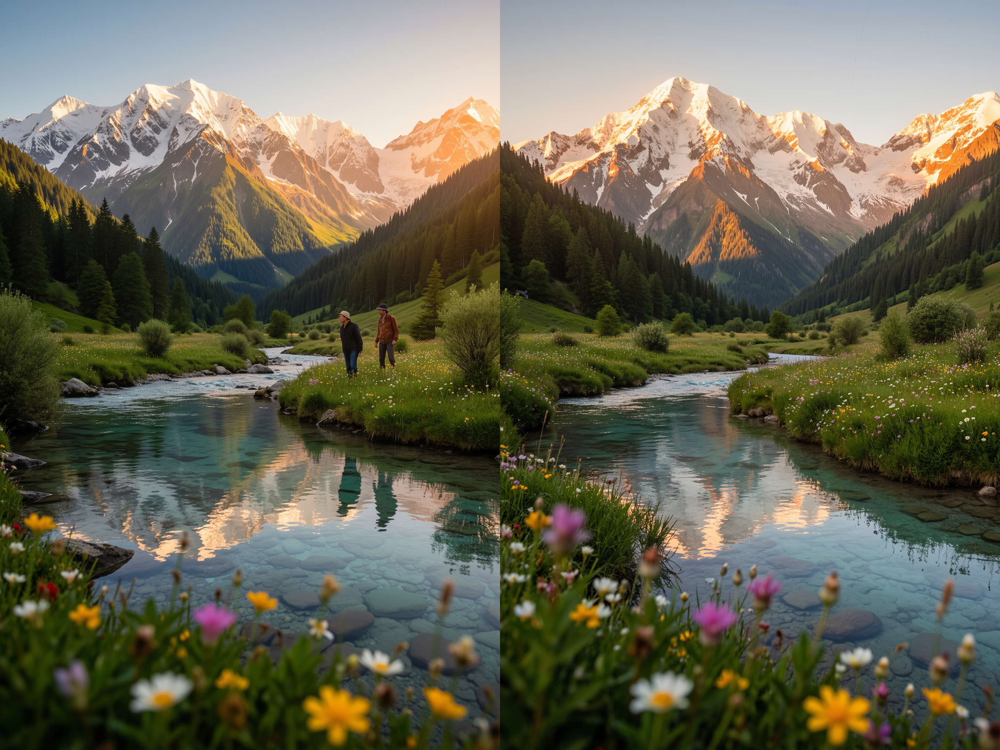
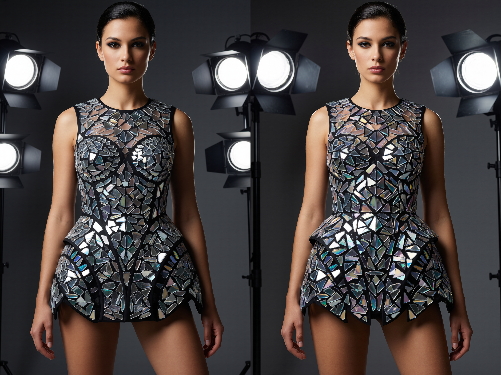
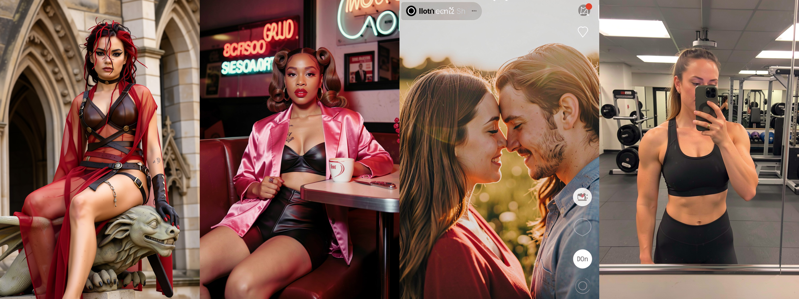
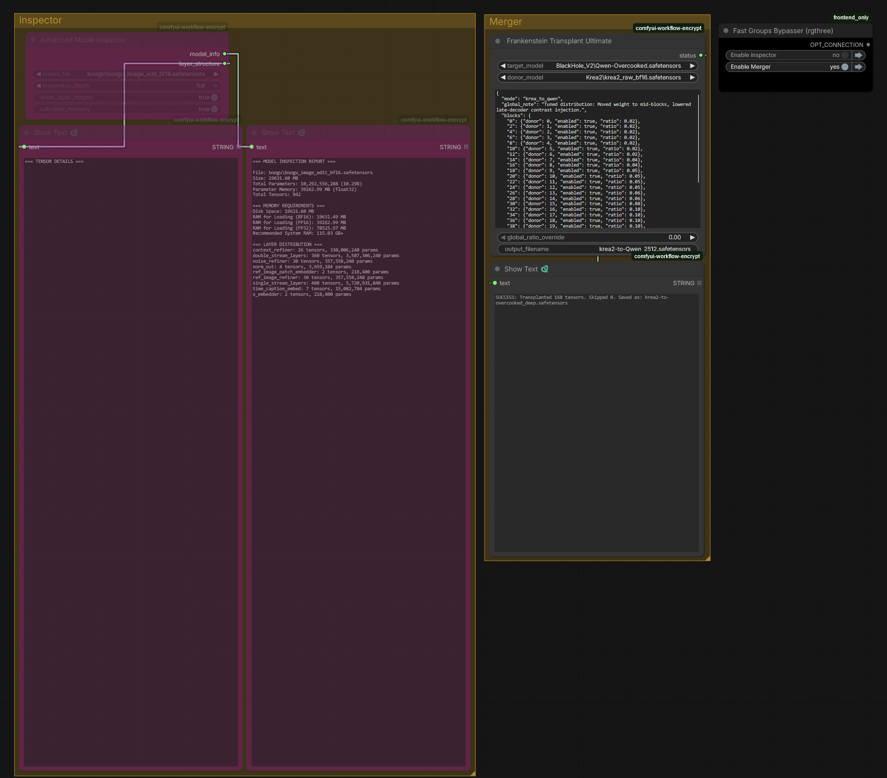

# Cross-Architecture Weight Grafting


> **Experimental research for combining AI image models with different architectures.**

## Introduction

This project started as a simple question:

**Can we combine the strengths of completely different AI image models, even if they were never designed to be merged?**

Traditional model merging only works when both models have the same architecture and matching layer sizes. Models such as Qwen-Image, Krea 2, FLUX and Klein are built differently, so standard merge tools usually cannot combine them correctly.

This project explores a different approach called **Cross-Architecture Weight Grafting**.

Instead of performing a normal merge, it selectively transfers small parts of one model into another by matching layers, adjusting tensor sizes where needed, and blending only a small percentage of the weights.

The goal is not to replace the original model. The goal is to see whether one model can borrow some visual qualities from another while keeping its own strengths.

---

# How It Works

The workflow follows a few simple steps:

* Inspect the transformer layers of both models.
* Find blocks that appear to perform similar jobs.
* Adjust tensor sizes where necessary so the weights can fit.
* Blend only a small amount of the source weights into the target model.

Keeping the blend ratio low is important. Large changes usually damage the original model and reduce image quality.

You can think of this as a **weight transplant** rather than a traditional model merge.

---

# Current Experiments

This experiment was performed using the following models:

### Base Model
- Qwen-Image-2512 (custom fine-tuned version)
  - Civitai: https://civitai.red/models/2557806/qwen-overcooked?modelVersionId=2874469

### Donor Model
- Krea-2-Raw (official release)
  - Official download: https://huggingface.co/krea/Krea-2-Raw

## Best Result

### Krea 2 → Qwen-Image-2512

This is currently the best combination I have found.

Qwen-Image already produces excellent composition, prompt understanding and image structure.

Krea 2 produces beautiful lighting, realistic textures and a more photographic look.

By transferring a small amount of Krea 2's weights into Qwen-Image, the images appear to keep Qwen's strong structure while gaining some of Krea's visual style.

The best results so far were achieved using approximately:

```text
- Early layers: 2–4%
- Middle layers: 5–10%
- Late layers: 3–8%
```

Higher values usually reduced image quality or changed the behaviour of the model too much.

---

## Comparison Examples

### Example 1

**Left:** Original Qwen-Image-2512

**Right:** Cross-Architecture Weight Grafting (Krea 2 → Qwen-Image-2512)


---

### Example 2




---

### Example 3




---

### Example 4



---

### Example 5



---

### Example 6



---

# Other Experiments

Not every combination produced useful results.

## Qwen-Image-2512 → Krea 2

The generated images lost much of Krea's original realism and gradually started looking more like a weaker version of Qwen.

---

## FLUX → Other Architectures

Some combinations successfully generated images, but the overall quality was inconsistent.

Common problems included:

* softer details
* higher contrast
* reduced texture quality
* unnatural lighting

These results suggest that simply matching tensor sizes is not enough. Different models learn internal features in different ways, so some combinations work much better than others.

### Example Flux 2 dev to Klein 9b

All images are final merged version of klien 9B



### Example Flux 2 dev to Flux 1 Dev

All images are final merged version of Flux Dev 1


---

# Repository Contents

This repository contains:

* Custom ComfyUI workflow
* Configuration files used during testing
* Example comparison images
* Documentation explaining the process

Everything included here is the same workflow and settings used for the experiments shown above.

If you would like to test different mappings or weight ratios, feel free to experiment and share your results.

---

# Why I Am Not Sharing the Merged Model

You may notice that this repository does **not** include the merged `.safetensors` checkpoint.

The reason is simple.

The original models used in these experiments are released under different licenses. Some licenses place restrictions on sharing modified model weights or redistributing derivative checkpoints.

Rather than risk violating those licenses, I have chosen **not** to upload the merged model.

Instead, this repository provides the workflow, configuration files and documentation so anyone can reproduce the experiments using the original models downloaded from their official sources.

This approach respects the original model creators while still allowing others to explore the same ideas.

---

# Important Note

This is an experimental research project.

The purpose is simply to explore whether useful visual features can be transferred between models with different architectures.

Some combinations produce surprisingly good results, while others produce poor or unexpected outputs.

The workflows and configuration files included in this repository are the exact settings used during my testing. I hope they provide a useful starting point for anyone interested in exploring different model combinations.

---
## Requirements

Hardware: CPU only. No GPU is required.

System RAM: The minimum RAM needed depends on the size of the target model, not the donor model. For example, grafting a large donor model (like a 65GB Flux 2) into a smaller target model (like Klein 9B) will only consume RAM based on the Klein 9B's size, plus a small overhead for the merging process. As a baseline, ensure your system has enough RAM to load and save the target model comfortably (target model size + 4–8 GB of overhead).


## Installation

Copy the `Advanced_Model_Inspector` and `ComfyUI-FrankensteinTransplant` into your `ComfyUI/custom_nodes/` directory, then restart ComfyUI. 

A preview of the workflow is available in the `examples` folder as `workflow.jpg`.

## Usage

Load the workflow in ComfyUI. You will see two main groups: **Model Inspector** and **Merger**.

### Model Inspector
Use this to analyze a model and build a custom configuration. Select the model and run the workflow. It takes a few seconds to output the block information needed for your config. Refer to the included example configs to see the correct format.

### Merger
1. Select the target and donor models.
2. Paste your configuration into the text box.
3. Enter a name for the new merged model.
4. Run the workflow.

*Note: If the global ratio is set above 0, it overrides your custom layer-based ratios and applies the global value to all layers.*

### Workflow




# Credits

This project builds on the amazing work of the original model creators.

* **Qwen Team** — Qwen-Image-2512
* **Krea AI** — Krea 2
* **Black Forest Labs** — FLUX
* **Klein AI Team** — Klein

A big thank you to everyone in the open-source AI community who develops tools for inspecting, training and experimenting with modern generative models.

---

## Disclaimer

This project is an independent research experiment and is not affiliated with or endorsed by the creators of the original models.

Please download all original models from their official sources and follow the license terms provided by their respective authors.
