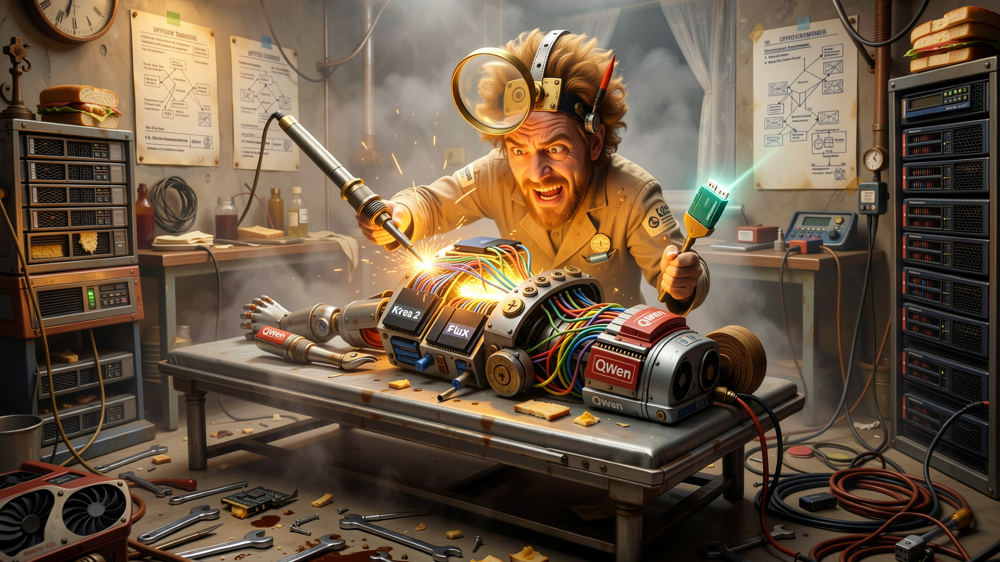
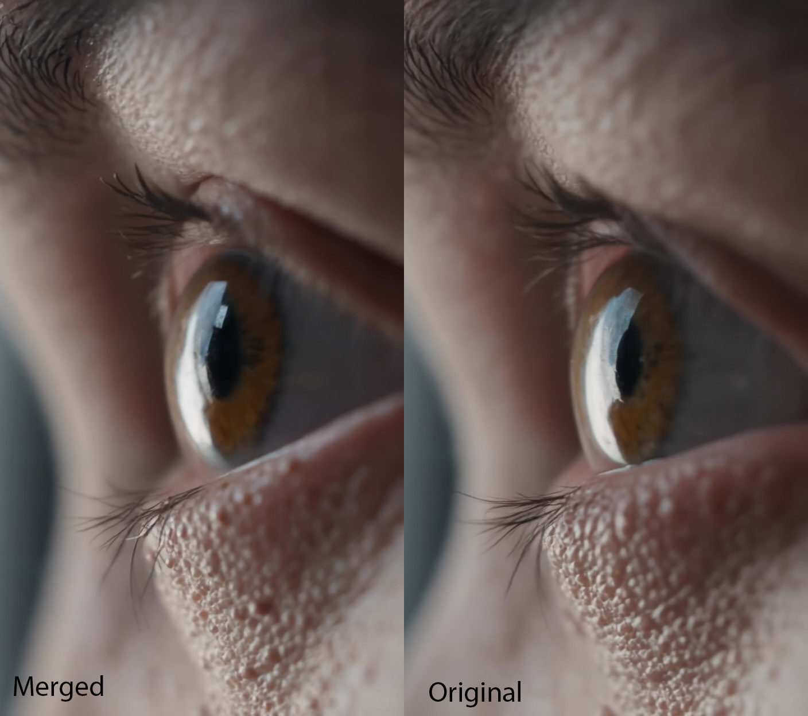
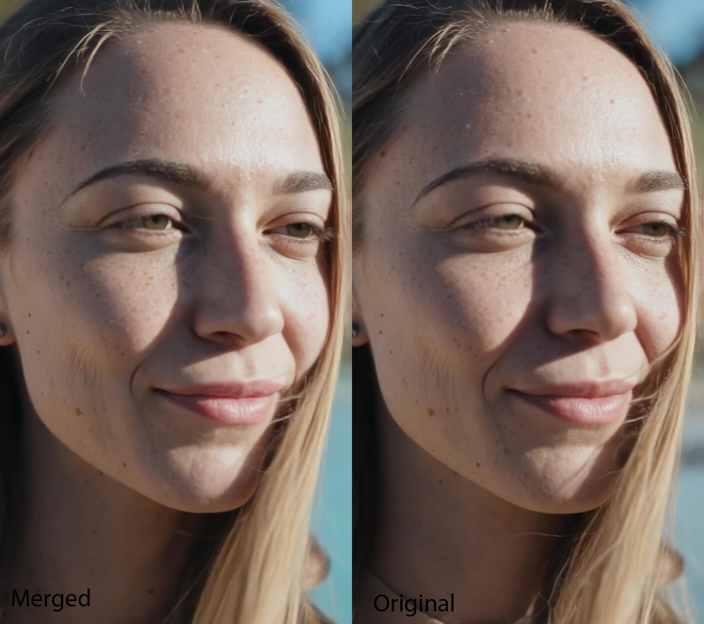
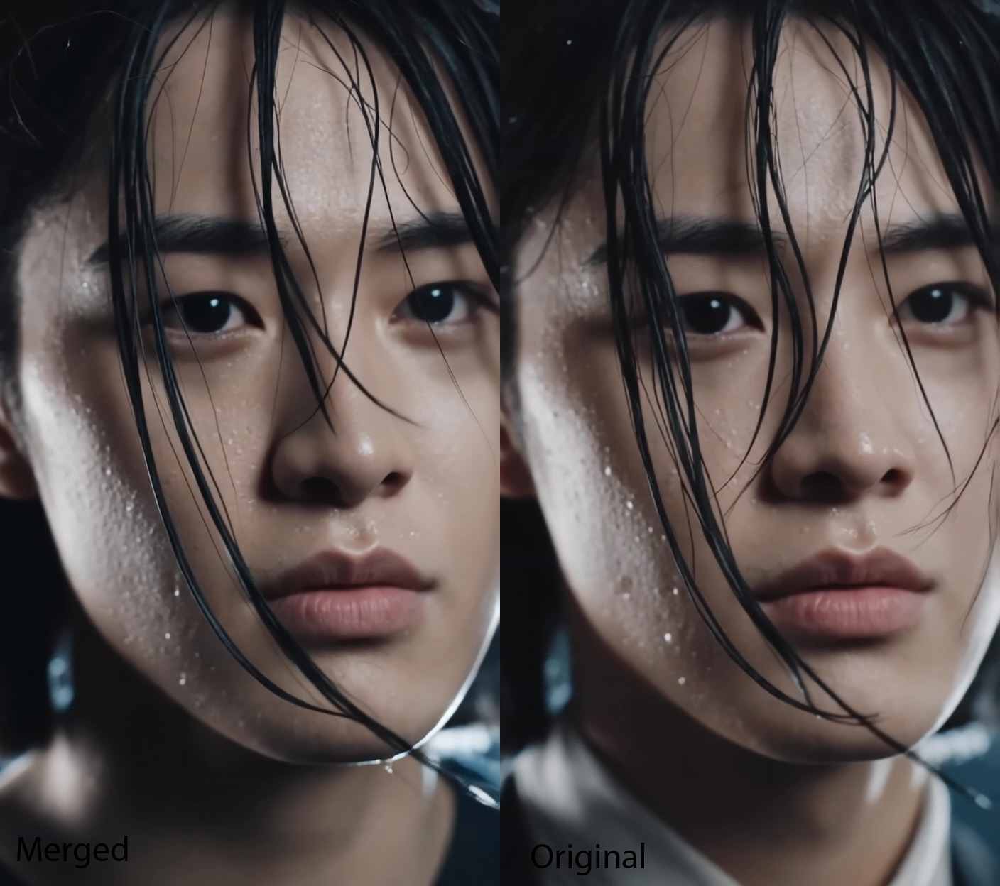

# Cross-Architecture Weight Grafting

> **Experimental research for combining AI image models with different architectures.**

## Introduction

This project started as a simple question:

**Can we combine the strengths of completely different AI image models, even if they were never designed to be merged?**

Traditional model merging only works when both models have the same architecture and matching layer sizes. Models such as Qwen-Image, Krea 2, FLUX and Klein are built differently, so standard merge tools usually cannot combine them correctly.

This project explores a different approach called **Cross-Architecture Weight Grafting**.

Instead of performing a normal merge, it selectively transfers small parts of one model into another by matching layers, adjusting tensor sizes where needed, and blending only a small percentage of the weights.

The goal is not to replace the original model. The goal is to see whether one model can borrow some visual qualities from another while keeping its own strengths.

---

 Video Model Experiments: LTX 2.3 + Wan 2.2

This branch is all about merging video generation models. I'm testing if we can take the best parts from different models and combine them into something better.

## What I'm Doing

Right now, I'm merging **Wan 2.2 Low-Noise** into **LTX Video 2.3 Dev**.

**Why?** 
- LTX 2.3 has great structure and follows prompts well
- Wan 2.2 Low-Noise creates incredibly clean, detailed textures (skin pores, hair, water droplets)
- The goal: Keep LTX's strengths but add Wan's photorealistic detail

## How It Works

The merge node does three smart things:

1. **Automatic Size Matching**: Wan 2.2 is bigger (5120 hidden dimension) than LTX 2.3 (4096). The node automatically shrinks Wan's weights to fit, padding with zeros where needed.

2. **CPU-Only Processing**: All the heavy lifting happens on your system RAM, not your GPU. This prevents crashes on 24GB cards.

3. **Smart Tensor Handling**: It detects FP8 tensors, converts them safely, and only merges `.weight` tensors (ignoring `.bias`) to avoid shape mismatches.

## What You'll Need

**Hardware:**
- **System RAM**: 128GB recommended (we're loading two huge models at once)
- **VRAM**: 24GB minimum (for generating video after the merge)

**Models:**
- LTX Video 2.3 Dev (or Distilled)
- Wan 2.2 Low-Noise BF16

## Coming Soon

I'm still testing, but this branch will include:

- ** Advanced Model Inspector** - Check model keys and shapes without loading the whole file
- **🎬 Video Preset Loader** - Pre-configured merge ratios (Conservative, Balanced, Aggressive)
- **🧬 Video Transplant Node** - The actual merge engine

## Test Results

### Example 1: Extreme Macro Detail

**Merged (Left)** vs **Original LTX 2.3 (Right)**

---

### Example 2: Skin Texture & Freckles

**Merged (Left)** vs **Original LTX 2.3 (Right)**

---

### Example 3: Wet Hair & Water Droplets

**Merged (Left)** vs **Original LTX 2.3 (Right)**

---

## What I'm Seeing

Early tests show the merged model:

✅ **Better micro-textures** - Sharper pores, finer hair strands, crisper water droplets  
✅ **Same identity** - No face drift or geometry changes  
✅ **Cleaner shadows** - Less noise in dark areas  
✅ **Preserved lighting** - Cinematic contrast stays intact  

⚠️ **Still testing** - I need to run more comparisons before declaring victory

## How to Use (Once Ready)

1. Clone this branch to your `custom_nodes` folder
2. Restart ComfyUI
3. Use the **Model Inspector** to verify your model files
4. Run the **Transplant Node** and wait for the merge
5. Test with short prompts first!

## Status

 **Active Testing** - This is experimental. The nodes work, but I'm still tuning the merge ratios and verifying quality. Check back soon for updates.
